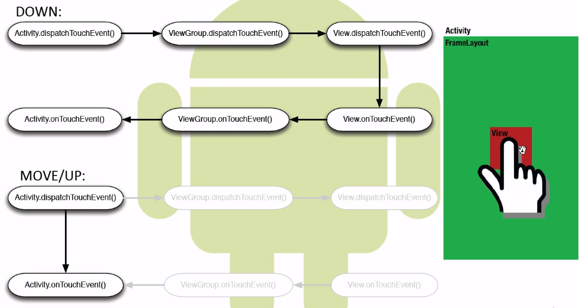

说到touch事件的传递，首先想到touch事件的3个类型
ACTION_DOWN, ACTION_MOVE, ACTION_UP
其次想到touch事件传递的三个阶段
1. 分发（dispatch）
-> dispatchTouchEvent(MotionEvent ev)
2. 拦截（intercept）
-> onInterceptTouchEvent(MotionEvent ev)
3. 消费（consume）
-> onTouchEvent(MotionEvent ev)

Activity, ViewGroup, View 都有分发和消费的能力(dispatchTouchEvent & onTouchEvent)
同时只有 ViewGroup有拦截的能力(onInterceptTouchEvent)
view和viewGroup还有请求父ViewGroup跳过拦截的能力(parent.requestDisallowInterceptTouchEvent)  

  

  

事件传递是为了解决滑动冲突  
http://blog.csdn.net/a992036795/article/details/51735501  
* 外部拦截法：外部拦截法是指点击事件先经过父容器的拦截处理，如果父容器需要处理此事件就进行拦截，如果不需要此事件就不拦截，这样就可以解决滑动冲突的问题。外部拦截法需要重写父容器的onInterceptTouchEvent()方法，在内部做相应的拦截即可。   
* 内部拦截法：内部拦截法是指点击事件先经过子View处理，如果子View需要此事件就直接消耗掉，否则就交给父容器进行处理，这样就可以解决滑动冲突的问题。内部拦截法需要在onTouchEvent()中配合requestDisallowInterceptTouchEvent()方法，来确定子View是否允许父布局拦截事件。