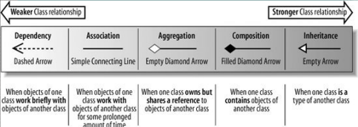
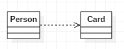
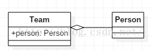
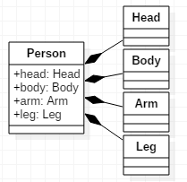
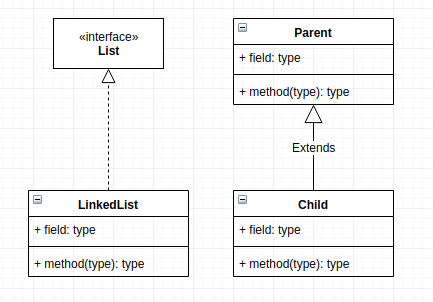

类之间大体分为5种关系：  
  

# 1. 依赖关系(Dependency)  
单向，表示一个类依赖于另一个类的定义，其中一个类的变化将影响另外一个类，是一种 `use a` 关系

如果A依赖于B，则B表现为A的局部变量，方法参数，静态方法调用等  
  
```java
public class Person {  
    public void doSomething(){  
        Card card = new Card();//局部变量  
        ....  
    }  
} 
```
```java
public class Person {  
    public void doSomething(Card card){//方法参数  
        ....  
    }  
}  
```
```java
public class Person {  
    public void doSomething(){  
        int id = Card.getId();//静态方法调用  
        ...  
    }  
}  
```

# 2. 关联关系(Association)  
单向或双向（通常我们需要避免使用双向关联关系），是一种 `has a` 关系，如果A单向关联B，则可以说A has a B，通常表现为全局变量  
  
```java
public class Person {  
    public Phone phone;  
      
    public void setPhone(Phone phone){        
        this.phone = phone;  
    }  
      
    public Phone getPhone(){          
        return phone;  
    }  
}
```
# 3. 聚合关系(Aggregation)  
单向，关联关系的一种，与关联关系之间的区别是语义上的，关联的两个对象通常是平等的，聚合则一般不平等，有一种整体和局部的感觉，实现上区别不大  
  
Class由Student组成，其生命周期不同，整体不存在了，部分依然存在，当前Team解散了，人还在，还可以加入别的组  
```java
public class Team {  
    public Person person;  
      
    public Team(Person person){  
        this.person = person;  
    }  
}  
```
# 4. 组合关系(Composition)  
单向，是一种强依赖的特殊聚合关系  
  
Head，Body，Arm和Leg组合成People，其生命周期相同，如果整体不存在了，部分也将消亡  
```java
public class Person {  
    public Head head;  
    public Body body;  
    public Arm arm;  
    public Leg leg;  
      
    public Person(){  
        head = new Head();  
        body = new Body();  
        arm = new Arm();  
        leg = new Leg();  
    }  
} 
```
# 5. 继承关系(Inheritance)  
  

类实现接口，类继承抽象类，类继承父类都属于这种关系

可以分得更细：

实现（Realization）：类实现接口属于这种关系

泛化（Generalization）：即 `is a` 关系，类继承抽象类，类继承父类都属于这种关系  

---
_更多内容：https://www.cnblogs.com/shindo/p/5579191.html_